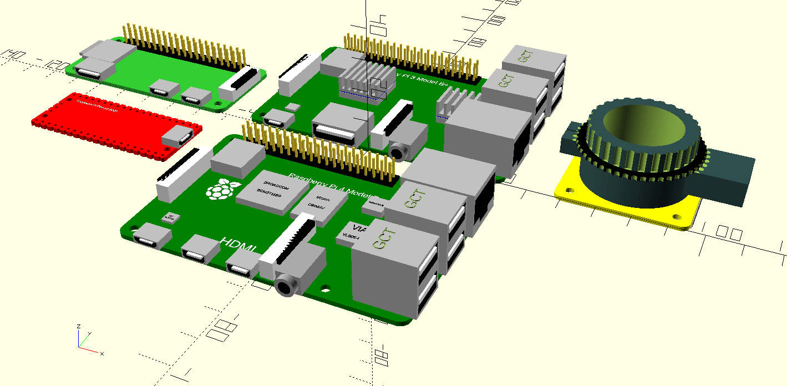
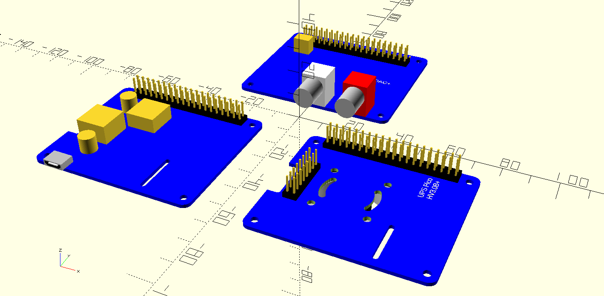
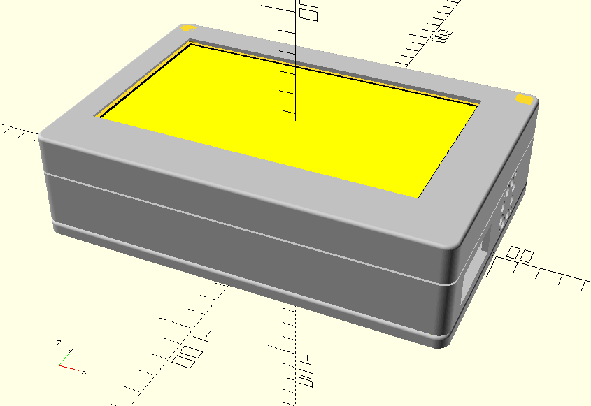
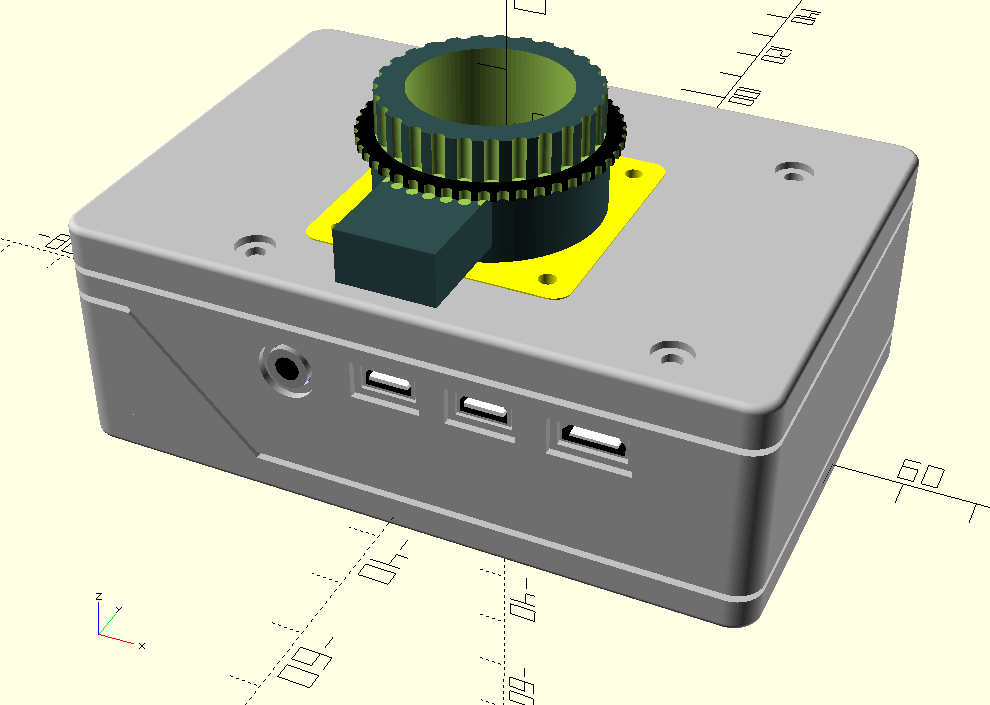
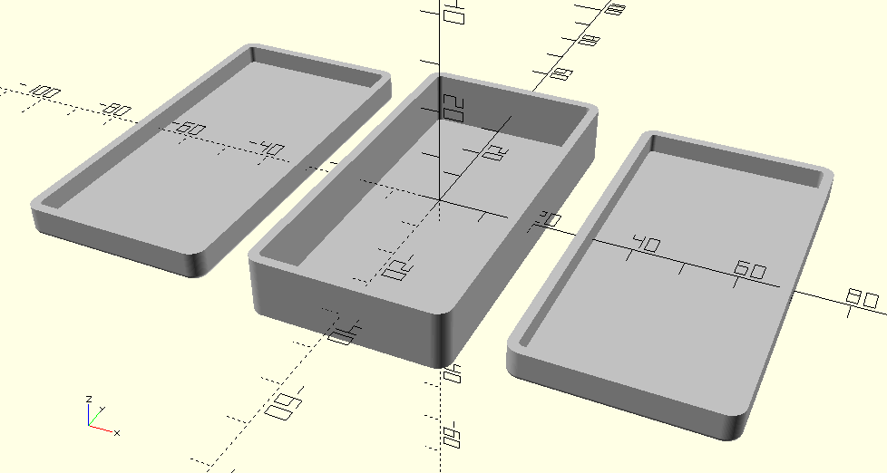

# RaspberryPiCases
OpenSCAD sources for Raspberry Pi cases and Raspberry Pi module dummies.

To display the different parts of the case use the different variables in the first lines of the source files.
Also the display of the modules can be switches on also with an variable.

    // Which one would you like to see?
    displayFront = false;         // Front part of the case
    displayChassis = true;       // Chassis part of the case
    displayBack = false;          // Back part of the case
    displayAll = false;           // All parts together
    displayImage = false;         // All parts together in one image

    displayDevices = true;
    withThread = false;

To generate the STL for the 3D printer switch on only the wished part and switch off the display of the device.

## Raspberry Pi modules
The sub directory 'raspberry' contain the dummy modules for some types of Raspberry Pi, some Raspberry Products and the Raspberry Pi printed circuit boards.

## Raspberry Pi HAT modules
The sub directory 'hat' contain the dummy modules for some Raspberry Pi HAT modules.

## Raspberry Pi 3b case for a net radio
The sub directory 'RadioPi' contain some cases for a net radio based on a Raspberry Pi 3b.

It has a 7" touch display, a Raspberry Pi 3b, a UPS HAT module and a audio interface HAT module inside.

## Raspberry Pi 4b case for StopMotionPi
The sub directory 'StopMotionPi' contain the case for the StopMotionPi project.

It has a Raspberry Pi 4b and a UPS HAT module inside and a mount for the Raspberry HQ camera outside.

## Universal three part case
As a base for most of the cases, the sub directory 'parts' contain the empty three part case and all the active and passive components.

